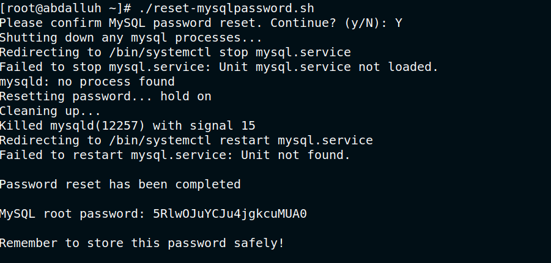

## Bash script to reset MySQL password

Reset MySql password and save password in /root/.my.cnf and secure it

# How to run
Open terminal and run below commands
``` 
git clonehttps://github.com/abdalluhmostafa/bash-reset-mysqlpassword
cd bash-reset-mysqlpassword
chmod +x reset-mysqlpassword.sh
./reset-mysqlpassword.sh
After script finished you may need to restart mysql or mariadb again

```

## Screenshots




